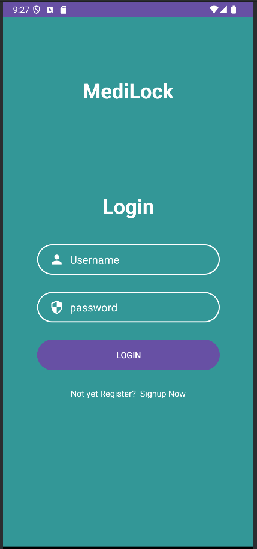
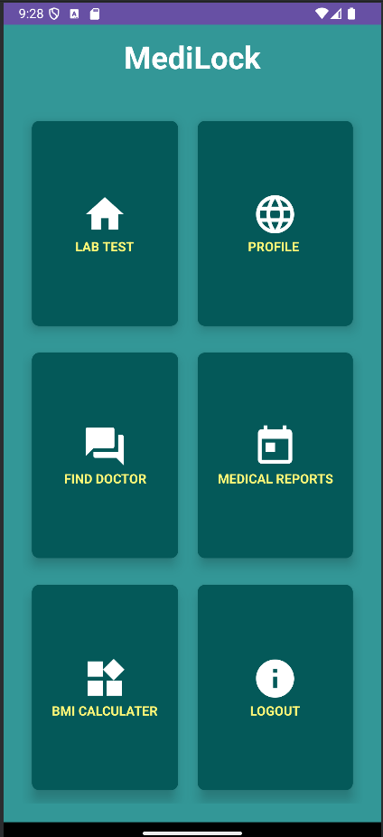
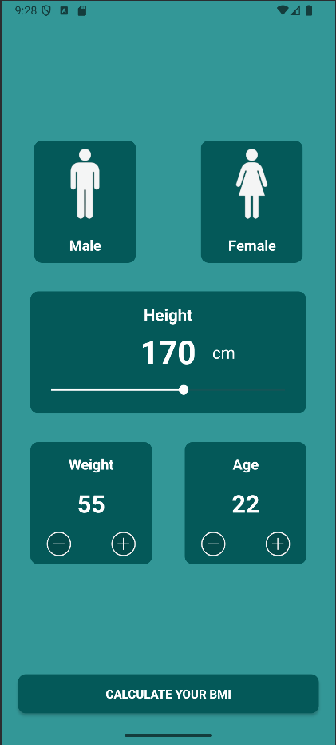

# MediLock

**MediLock** is an Android application designed to secure medical records,to calculate BMI etc. Built with Kotlin and AndroidX, MediLock ensures a smooth, modern, and responsive user experience.

## 🚀 Features

- Feature 1:  Medication tracking and reminders
- Feature 2:  Secure storage of medical history
- Feature 3:  Sync with cloud or backup options
- Feature 4:  BMI Calculator


## 🛠️ Tech Stack

- **Kotlin**
- **Android SDK**
- **Jetpack/AndroidX**
- **Gradle (Kotlin DSL)**

## 📦 Project Structure

- `app/` – Main application code
- `build.gradle.kts` – Kotlin DSL build configuration
- `gradle.properties` – JVM and AndroidX configuration
- `local.properties` – Local SDK path (excluded from version control)
- `.gitignore` – Standard ignore rules for Android and Gradle

## 🧑‍💻 Getting Started

### Prerequisites

- Android Studio (Arctic Fox or later)
- Android SDK installed
- Gradle 8.0 or later

## 📸 Screenshots

### 🔐 Login Screen


### 📊 Dashboard


### ⚖️ BMI Calculator


### Setup Instructions

```bash
git clone https://github.com/yourusername/medilock.git
cd medilock
./gradlew build


🙌 Contributing
Pull requests are welcome. For major changes, please open an issue first to discuss what you would like to change.
